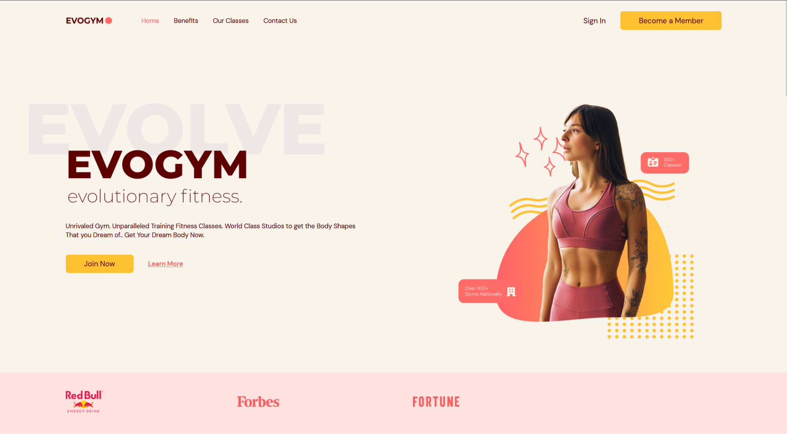

<br />
<div align="center">
  <h1 style="margin-bottom: 50px">Gym App </h1>

[](http://forthebadge.com)
[](http://forthebadge.com)
  
  
  
  </div>
  
  # 🚩 Table of Contents

- [About The Project](#about-the-project)
- [Features](#features)
- [Live Demo](#live-demo)
- [Built With
  ](#built-with
  )
- [Responsive Mobile](#responsive-mobile)  
- [Getting Started
  ](#getting-started)
- [Roadmap](#roadmap)
- [Contact](#contact)

## 🚀 Live Demo
   Link: https://gym-app-ms09.onrender.com
   
## 💬 About The Project
My motivation for writing this project was to expand my knowledge of working with data.
Thanks to this project I gained knowledge about data design and organized. It was a big challenge with many errors and a lot of knowledge.
  
Dashboard App is a project that helps you visualize sales statistics using tables, charts, diagrams and statistics.
In the project I used Material UI and Material UI Data Grid. I feel comfortable in this library and it's nice to work in it.
I also used Nivo, a library that visualizes diagrams,charts, maps and other things related to statistics and data organized.
I learned a lot about React Redux and how to use it in this project.The hardest part of the project was working with the backend controller logic. It was a dose of a lot of knowledge for me and a lot of time spent reading the documentation and looking for new solutions.

## 📦 Built With

<p align="center">
  <a href="https://skillicons.dev">
    
  </a>
</p>

##  🌏 Getting Started

To run this project, install it locally using npm.

### Prerequisites

Install the latest version of npm in your runtime.
* npm

  ```sh
  npm install npm@latest -g
  ```
  
 ### 🔧 Installation


1. Clone the repo

   ```sh
   git clone https://github.com/krystian2077/gym-app
   ```
3. Install NPM packages

   ```sh
   npm install
   ```
4. Run npm script

   ```sh
   npm run dev
   ```

## 🐾 Roadmap

- Add Login/Register with authentication
- Add dark/light mode


<!-- CONTACT -->
## 📞 Contact

Email: krystian.potaczek07@gmail.com

My phone number: 788-986-074
